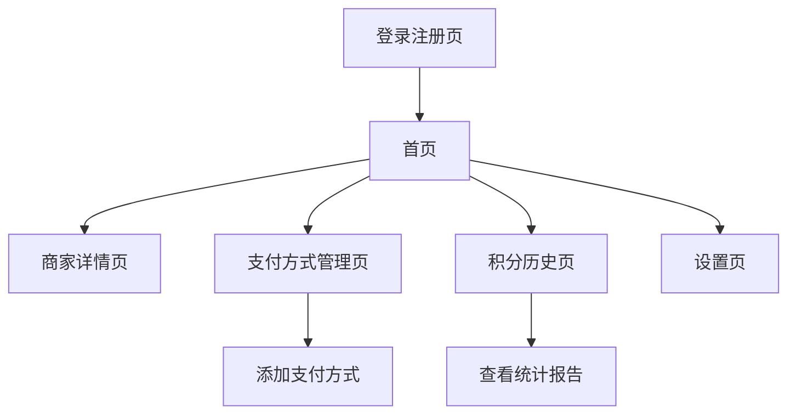

# 积分优化助手 - 产品需求文档

## 1. 产品概述

积分助手是一款智能移动应用，通过实时位置检测和支付方式分析，为用户推荐在当前商家获得最多积分的最优支付方式。

* 解决用户在多种支付方式中选择困难的问题，帮助用户最大化积分收益，提升消费体验。

* 目标市场：注重积分收益的消费者，预计能帮助用户平均提升20-30%的积分收益。

## 2. 核心功能

### 2.1 用户角色

| 角色   | 注册方式  | 核心权限                      |
| ---- | ----- | ------------------------- |
| 普通用户 | 手机号注册 | 查看积分推荐、管理支付方式、查看积分历史      |
| 高级用户 | 付费升级  | 获得更详细的积分分析、自定义提醒设置、优惠活动预告 |

### 2.2 功能模块

我们的积分优化助手包含以下主要页面：

1. **首页**：位置显示、推荐支付方式、快速积分查询
2. **支付方式管理页**：添加/删除支付方式、积分规则查看、优惠活动管理
3. **积分历史页**：积分收益统计、消费记录、趋势分析
4. **商家详情页**：商家积分规则、支付方式对比、用户评价
5. **设置页**：通知设置、定位权限、账户管理
6. **登录注册页**：用户认证、账户创建

### 2.3 页面详情

| 页面名称    | 模块名称   | 功能描述                                   |
| ------- | ------ | -------------------------------------- |
| 首页      | 位置检测模块 | 自动获取用户当前位置，识别附近商家                      |
| 首页      | 推荐引擎   | 基于位置和积分规则推荐最优支付方式                      |
| 首页      | 快速查询   | 显示当前推荐的支付方式和预期积分收益                     |
| 支付方式管理页 | 支付方式列表 | 添加、删除、编辑用户的支付方式（Pay、AuPay、乐天Pay、MPay等） |
| 支付方式管理页 | 积分规则管理 | 查看和更新各支付方式在不同商家的积分规则                   |
| 支付方式管理页 | 优惠活动管理 | 管理在线支付和线下支付的各种优惠活动信息                   |
| 积分历史页   | 积分统计   | 显示用户的积分收益历史和统计数据                       |
| 积分历史页   | 消费记录   | 记录用户的消费历史和使用的支付方式                      |
| 积分历史页   | 趋势分析   | 分析用户的积分收益趋势和优化建议                       |
| 商家详情页   | 商家信息   | 显示商家的积分政策和支持的支付方式                      |
| 商家详情页   | 支付对比   | 对比不同支付方式在该商家的积分收益                      |
| 设置页     | 通知设置   | 配置位置提醒、优惠活动通知等                         |
| 设置页     | 账户管理   | 用户信息编辑、隐私设置、数据导出                       |
| 登录注册页   | 用户认证   | 手机号登录、注册、密码重置                          |

## 3. 核心流程

**普通用户流程：**
用户打开应用 → 自动获取位置 → 识别附近商家 → 显示推荐支付方式 → 用户选择支付 → 记录积分收益

**支付方式管理流程：**
用户进入管理页面 → 添加新支付方式 → 设置积分规则 → 启用优惠活动 → 保存配置

## 4. 用户界面设计

### 4.1 设计风格

* **主色调：** 蓝色系 (#2196F3) 和绿色系 (#4CAF50)，传达信任和收益感

* **辅助色：** 橙色 (#FF9800) 用于重要提醒，灰色 (#757575) 用于次要信息

* **按钮样式：** 圆角矩形按钮，3D阴影效果

* **字体：** 系统默认字体，标题18px，正文14px，小字12px

* **布局风格：** 卡片式设计，顶部导航栏，底部标签栏

* **图标风格：** 扁平化设计，使用支付相关和位置相关的图标

### 4.2 页面设计概览

| 页面名称    | 模块名称   | UI元素                    |
| ------- | ------ | ----------------------- |
| 首页      | 位置检测模块 | 地图组件，当前位置标记，商家图标，蓝色主题   |
| 首页      | 推荐引擎   | 卡片式推荐区域，支付方式图标，积分数字高亮显示 |
| 支付方式管理页 | 支付方式列表 | 列表视图，每项包含支付方式图标、名称、状态开关 |
| 积分历史页   | 积分统计   | 图表组件，柱状图和折线图，绿色表示收益     |
| 商家详情页   | 商家信息   | 商家头图，信息卡片，支付方式对比表格      |
| 设置页     | 通知设置   | 开关组件，设置项列表，简洁的表单设计      |

### 4.3 响应式设计

产品采用移动端优先设计，针对iOS和Android平台优化，支持触摸交互和手势操作，适配不同屏幕尺寸。
