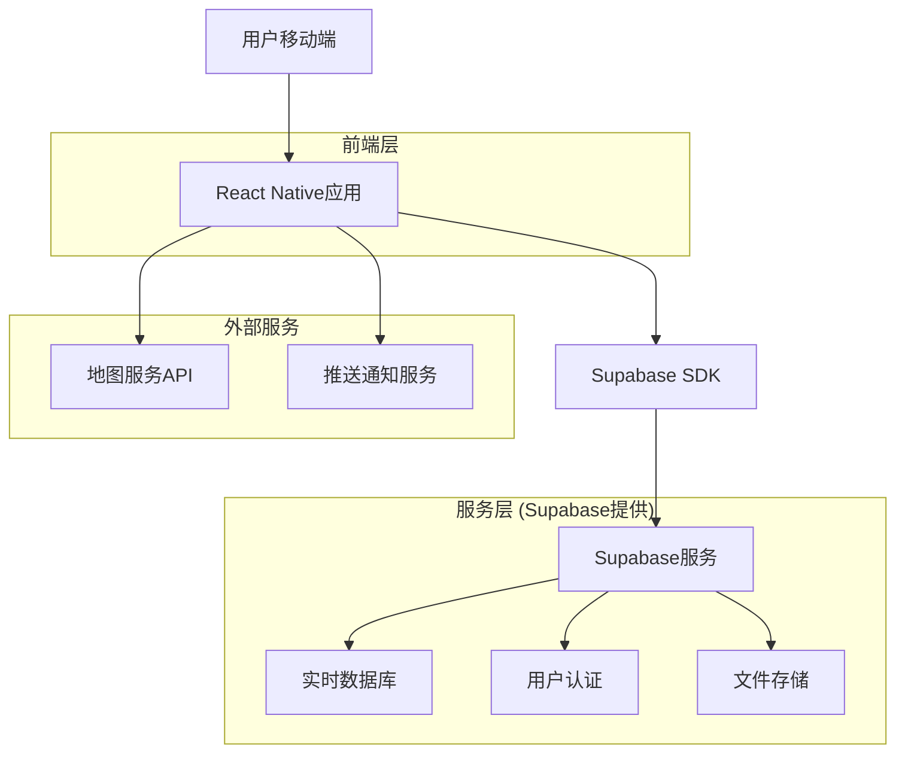
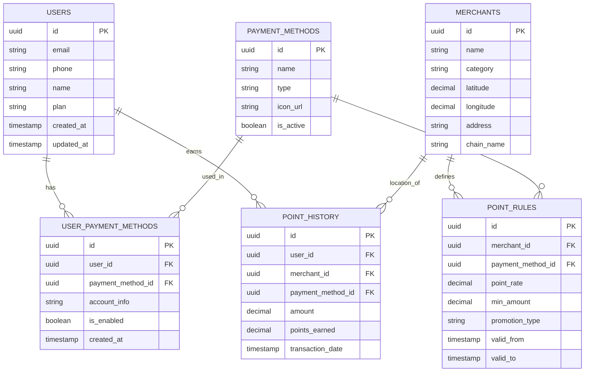

# 积分优化助手 - 技术架构文档

## 1. 架构设计



## 2. 技术描述

- **前端：** React Native@0.72 + TypeScript + React Navigation@6
- **状态管理：** Redux Toolkit + RTK Query
- **UI组件库：** React Native Elements + React Native Vector Icons
- **地图服务：** React Native Maps (Google Maps/Apple Maps)
- **后端服务：** Supabase (PostgreSQL数据库 + 实时订阅 + 用户认证)
- **推送通知：** React Native Push Notification + FCM

## 3. 路由定义

| 路由 | 用途 |
|------|------|
| /home | 首页，显示位置检测和推荐支付方式 |
| /login | 登录页面，用户认证 |
| /register | 注册页面，创建新用户账户 |
| /payment-methods | 支付方式管理页面，管理用户的支付方式 |
| /points-history | 积分历史页面，查看积分收益统计 |
| /merchant/:id | 商家详情页面，显示特定商家的积分规则 |
| /settings | 设置页面，用户偏好和通知配置 |
| /profile | 用户资料页面，个人信息管理 |

## 4. API定义

### 4.1 核心API

**用户认证相关**
```
POST /auth/v1/signup
```

请求参数：
| 参数名 | 参数类型 | 是否必需 | 描述 |
|--------|----------|----------|------|
| email | string | true | 用户邮箱 |
| password | string | true | 用户密码 |
| phone | string | true | 手机号码 |

响应参数：
| 参数名 | 参数类型 | 描述 |
|--------|----------|------|
| user | object | 用户信息对象 |
| session | object | 会话信息 |

**支付方式管理**
```
GET /rest/v1/payment_methods
POST /rest/v1/payment_methods
PUT /rest/v1/payment_methods/:id
DELETE /rest/v1/payment_methods/:id
```

**积分规则查询**
```
GET /rest/v1/point_rules
```

请求参数：
| 参数名 | 参数类型 | 是否必需 | 描述 |
|--------|----------|----------|------|
| merchant_id | string | false | 商家ID筛选 |
| payment_method | string | false | 支付方式筛选 |

**位置推荐**
```
POST /rest/v1/rpc/get_recommendations
```

请求参数：
| 参数名 | 参数类型 | 是否必需 | 描述 |
|--------|----------|----------|------|
| latitude | number | true | 纬度 |
| longitude | number | true | 经度 |
| user_id | string | true | 用户ID |

## 5. 数据模型

### 5.1 数据模型定义



### 5.2 数据定义语言

**用户表 (users)**
```sql
-- 创建用户表
CREATE TABLE users (
    id UUID PRIMARY KEY DEFAULT gen_random_uuid(),
    email VARCHAR(255) UNIQUE NOT NULL,
    phone VARCHAR(20) UNIQUE NOT NULL,
    name VARCHAR(100) NOT NULL,
    plan VARCHAR(20) DEFAULT 'free' CHECK (plan IN ('free', 'premium')),
    created_at TIMESTAMP WITH TIME ZONE DEFAULT NOW(),
    updated_at TIMESTAMP WITH TIME ZONE DEFAULT NOW()
);

-- 支付方式表
CREATE TABLE payment_methods (
    id UUID PRIMARY KEY DEFAULT gen_random_uuid(),
    name VARCHAR(100) NOT NULL,
    type VARCHAR(50) NOT NULL,
    icon_url TEXT,
    is_active BOOLEAN DEFAULT true,
    created_at TIMESTAMP WITH TIME ZONE DEFAULT NOW()
);

-- 用户支付方式关联表
CREATE TABLE user_payment_methods (
    id UUID PRIMARY KEY DEFAULT gen_random_uuid(),
    user_id UUID REFERENCES users(id) ON DELETE CASCADE,
    payment_method_id UUID REFERENCES payment_methods(id) ON DELETE CASCADE,
    account_info JSONB,
    is_enabled BOOLEAN DEFAULT true,
    created_at TIMESTAMP WITH TIME ZONE DEFAULT NOW()
);

-- 商家表
CREATE TABLE merchants (
    id UUID PRIMARY KEY DEFAULT gen_random_uuid(),
    name VARCHAR(200) NOT NULL,
    category VARCHAR(100),
    latitude DECIMAL(10, 8) NOT NULL,
    longitude DECIMAL(11, 8) NOT NULL,
    address TEXT,
    chain_name VARCHAR(100),
    created_at TIMESTAMP WITH TIME ZONE DEFAULT NOW()
);

-- 积分规则表
CREATE TABLE point_rules (
    id UUID PRIMARY KEY DEFAULT gen_random_uuid(),
    merchant_id UUID REFERENCES merchants(id) ON DELETE CASCADE,
    payment_method_id UUID REFERENCES payment_methods(id) ON DELETE CASCADE,
    point_rate DECIMAL(5, 2) NOT NULL,
    min_amount DECIMAL(10, 2) DEFAULT 0,
    promotion_type VARCHAR(50),
    valid_from TIMESTAMP WITH TIME ZONE DEFAULT NOW(),
    valid_to TIMESTAMP WITH TIME ZONE,
    created_at TIMESTAMP WITH TIME ZONE DEFAULT NOW()
);

-- 积分历史表
CREATE TABLE point_history (
    id UUID PRIMARY KEY DEFAULT gen_random_uuid(),
    user_id UUID REFERENCES users(id) ON DELETE CASCADE,
    merchant_id UUID REFERENCES merchants(id),
    payment_method_id UUID REFERENCES payment_methods(id),
    amount DECIMAL(10, 2) NOT NULL,
    points_earned DECIMAL(10, 2) NOT NULL,
    transaction_date TIMESTAMP WITH TIME ZONE DEFAULT NOW()
);

-- 创建索引
CREATE INDEX idx_user_payment_methods_user_id ON user_payment_methods(user_id);
CREATE INDEX idx_point_rules_merchant_payment ON point_rules(merchant_id, payment_method_id);
CREATE INDEX idx_point_history_user_date ON point_history(user_id, transaction_date DESC);
CREATE INDEX idx_merchants_location ON merchants(latitude, longitude);

-- 权限设置
GRANT SELECT ON ALL TABLES IN SCHEMA public TO anon;
GRANT ALL PRIVILEGES ON ALL TABLES IN SCHEMA public TO authenticated;

-- 初始化数据
INSERT INTO payment_methods (name, type, icon_url) VALUES
('Pay', 'mobile_payment', 'https://example.com/pay-icon.png'),
('AuPay', 'mobile_payment', 'https://example.com/aupay-icon.png'),
('乐天Pay', 'mobile_payment', 'https://example.com/rakuten-pay-icon.png'),
('MPay', 'mobile_payment', 'https://example.com/mpay-icon.png');

INSERT INTO merchants (name, category, latitude, longitude, address, chain_name) VALUES
('7-Eleven 新宿店', 'convenience_store', 35.6895, 139.7006, '东京都新宿区', '7-Eleven'),
('全家便利店 涩谷店', 'convenience_store', 35.6598, 139.7006, '东京都涩谷区', 'FamilyMart'),
('罗森便利店 银座店', 'convenience_store', 35.6762, 139.7653, '东京都中央区银座', 'Lawson');
```

**推荐算法函数**
```sql
-- 创建推荐函数
CREATE OR REPLACE FUNCTION get_recommendations(user_lat DECIMAL, user_lng DECIMAL, user_uuid UUID)
RETURNS TABLE(
    merchant_id UUID,
    merchant_name VARCHAR,
    payment_method_id UUID,
    payment_method_name VARCHAR,
    point_rate DECIMAL,
    distance_km DECIMAL
) AS $$
BEGIN
    RETURN QUERY
    SELECT 
        m.id,
        m.name,
        pr.payment_method_id,
        pm.name,
        pr.point_rate,
        ROUND(
            (6371 * acos(
                cos(radians(user_lat)) * cos(radians(m.latitude)) *
                cos(radians(m.longitude) - radians(user_lng)) +
                sin(radians(user_lat)) * sin(radians(m.latitude))
            ))::DECIMAL, 2
        ) as distance
    FROM merchants m
    JOIN point_rules pr ON m.id = pr.merchant_id
    JOIN payment_methods pm ON pr.payment_method_id = pm.id
    WHERE 
        pr.valid_from <= NOW() 
        AND (pr.valid_to IS NULL OR pr.valid_to >= NOW())
        AND pm.is_active = true
    ORDER BY distance ASC, pr.point_rate DESC
    LIMIT 10;
END;
$$ LANGUAGE plpgsql;
```